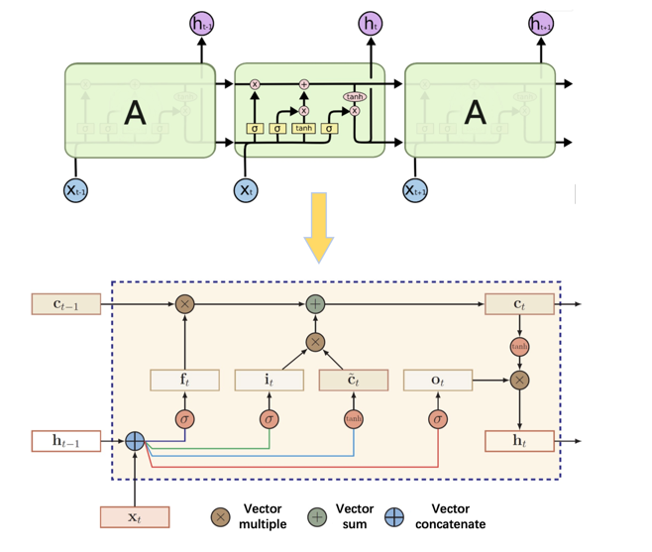
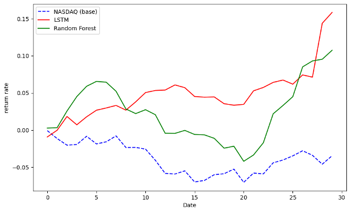

<h1>
<b>
A Comparative Analysis of Portfolio Optimization: LSTM vs. Random Forests
</b>
</h1>
<h4>
<b>
Jinyuan Sun
    
Beijing University of Posts and Telecommunications
</b>
</h4>

[Paper Link](https://github.com/Jinyuan-S/portfolio_optimization/blob/main/) This repo contains the official implementation of the paper. CONF-SPML 2024 (The 4th International Conference on Signal Processing and Machine Learning)

# Abstract
Portfolios represent a structured framework aiming to maximize returns while simultaneously minimizing risks, with applications spanning various domains, including stock investments, production optimization, and engineering models. Portfolio optimization remains a perpetual subject of interest within the realm of finance, and recent advancements in deep learning techniques provide a novel perspective for its exploration. This essay focuses on a selection of healthcare-related stocks, namely LLY, PGR, CI, and UNH, within the timeframe of **May 10, 2019, to October 16, 2023**. Initially, this study involves training Long Short-Term Memory (LSTM) and Random Forest models on data up to September 5th, employing a 30-day shifting window to capture stock trends. Subsequently, a portfolio strategy is employed for forecasting results, yielding both a model maximum Sharpe ratio and another minimizing risk along the efficient frontier of Monte Carlo simulations. By employing these two portfolio models and comparing their results with the performance of the NASDAQ over the same period, this essay concludes that both models outperform the NASDAQ and the LSTM models in this research demonstrate superior performance relative to Random Forest models.

# New up-to-date Dataset from kaggle
* The daily stock data utilized in this research has been sourced from Kaggle, a well-regarded data [repository](https://www.kaggle.com/datasets/svaningelgem/nyse-100-daily-stock-prices) and is provided by the New York Stock Exchange (NYSE). The process of stock selection is grounded in the assessment of average daily returns during the period spanning from May 10, 2019, to October 16, 2023. The selection criteria involve ranking stocks in descending order based on their performance, and the top 100 performing stocks are chosen for training the LSTM and random forest models. Finally, the paper ultimately narrows its focus to four stocks within the healthcare and insurance sectors, specifically represented by LLY, PGR, CI, and UNH 

# LSTM in Portfolio Optimization
* LSTM, short for Long Short-Term Memory, represents a cutting-edge prediction method in the realm of artificial intelligence. It operates as a specialized type of artificial neural network, frequently employed in the domain of deep learning to process and analyze sequential data. The LSTM's adeptness in handling long-term dependencies, coupled with its enhanced performance relative to conventional Recurrent Neural Networks (RNNs), has propelled its widespread adoption across diverse domains. Three essential parts—the input gate, the forget gate, and the output gate—are what make LSTMs so successful.

# The cumulative return rates of NASDAQ, LSTM, and Random Forest
* The research uses the historical returns of the NASDAQ index as a benchmark during the test period to evaluate each model's performance. Subsequently, the research conducts an ex-post analysis to discern the actual returns generated by each portfolio. Encapsulating this evaluation is an annualized "tear sheet," a comprehensive summary displayed in the following graph. This visual representation delineates the cumulative returns achieved through two distinct methods, alongside the performance of the NASDAQ index, offering a clear and illustrative comparison of the portfolio outcomes

# Environment Installation
* pandas==0.22.0
* numpy==1.13.3
* tqdm==4.43.0
* torch==1.7.1+cu101
* scikit_learn==1.0.2

